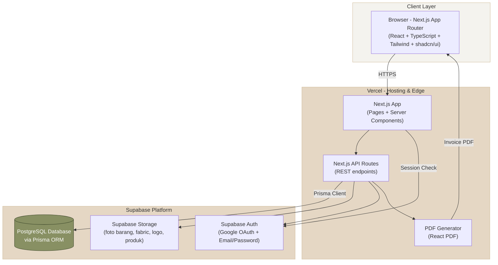
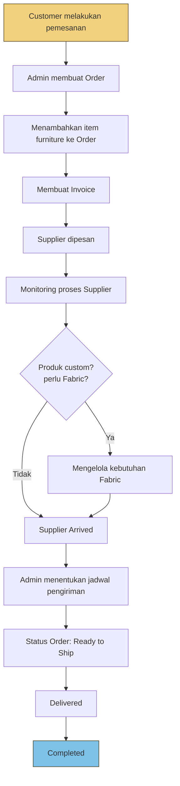
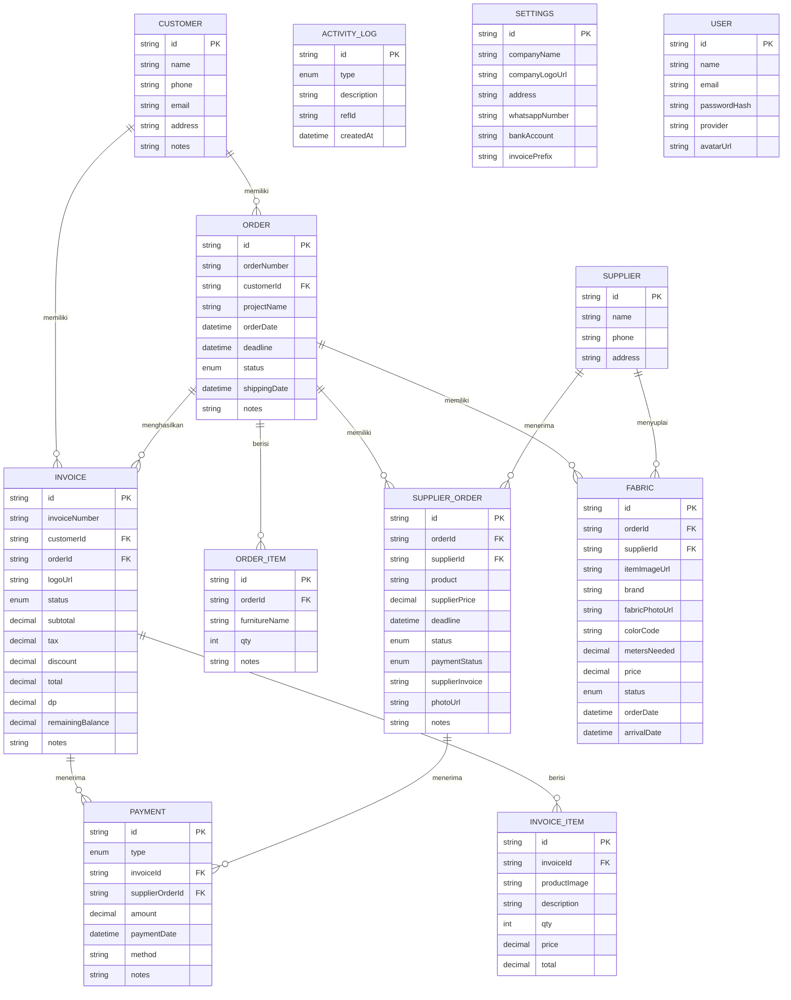

# Product Requirements Document (PRD)
## Furniture Order & Production Management System — DC Habitat

---

## 1. Overview

**Furniture Order & Production Management System** adalah sistem berbasis web untuk mengelola operasional bisnis furniture DC Habitat, mulai dari pencatatan pesanan pelanggan, pembuatan invoice, pemantauan supplier, pengelolaan kebutuhan kain (fabric) untuk produk custom, hingga pengelolaan pembayaran dan proses pengiriman.

Sistem ini digunakan sepenuhnya oleh **Admin** sebagai pusat pengelolaan seluruh aktivitas operasional. Seluruh informasi yang berkaitan dengan satu order dikelola dalam satu halaman (Order Detail) sehingga memudahkan admin memantau progres setiap pesanan dari awal hingga selesai.

---

## 2. Tech Stack

| Layer | Teknologi |
|---|---|
| Frontend | React, Next.js, TypeScript, Tailwind CSS, shadcn/ui |
| Backend | Next.js API Routes |
| ORM | Prisma |
| Database | PostgreSQL (Supabase) |
| Authentication | Google OAuth, Email & Password |
| PDF Generation | React PDF / PDF Generator |
| File Storage | Supabase Storage (foto barang, fabric, logo, produk) |
| Deployment | Vercel (app), Supabase (DB, Auth, Storage) |

---

## 3. Role & Akses

### Admin
Akses penuh terhadap seluruh sistem: Dashboard, Customer, Order, Supplier, Fabric Management, Invoice, Finance, dan Settings. Saat ini sistem dirancang single-role (admin only); struktur role sudah disiapkan agar mudah ditambah role baru di masa depan (mis. staff produksi, staff gudang).

---

## 4. System Architecture



**Catatan arsitektur:**
- Next.js API Routes berfungsi sebagai backend layer, berkomunikasi dengan PostgreSQL melalui **Prisma ORM**.
- Supabase menyediakan 3 layanan utama: Database (Postgres), Auth (Google OAuth + Email/Password), dan Storage (untuk semua file upload: foto barang supplier, foto fabric, logo perusahaan, gambar produk invoice).
- PDF invoice digenerate secara server-side lalu dikirim ke client untuk preview/download.

---

## 5. Business Flow



### Order Status Flow
`Waiting Supplier → Waiting Fabric → In Production → Ready to Ship → Delivered → Completed`

### Supplier Status Flow
`Waiting → Ordered → In Production → Ready → Shipped → Arrived`

> Ketika status Supplier berubah menjadi **Arrived**, admin mengisi **Tanggal Pengiriman**, dan status Order otomatis berubah menjadi **Ready to Ship**.

### Fabric Status Flow
`Not Ordered → Ordered → Arrived`

### Invoice Status Flow
`Draft → Sent → Partial → Paid` (atau `Cancelled` di titik manapun sebelum Paid)

---

## 6. Module Structure

```
Dashboard
├── Customers
├── Orders
│   └── Order Detail
├── Suppliers
├── Fabric Management
├── Invoices
├── Finance
└── Settings
```

---

## 7. Feature Details

### 7.1 Dashboard
Menampilkan ringkasan operasional bisnis secara real-time.

**KPI Cards:**
- Income This Month
- Supplier Payment Pending
- Upcoming Deadlines
- Ready to Ship

**Income Chart** — grafik pendapatan bulanan.

**Upcoming Deadline** — daftar pesanan supplier yang akan melewati tenggat waktu, menampilkan: Customer, Supplier, Deadline Supplier, Status.

**Recent Activity** — log aktivitas terbaru: invoice dibuat, invoice diperbarui, supplier ditambahkan, supplier dibayar, supplier selesai, fabric ditambahkan, fabric diterima.

### 7.2 Customer
Direktori pelanggan.

**Data disimpan:** Nama, Nomor Telepon, Email, Alamat, Catatan.

**Halaman Detail Customer:**
- Informasi Customer
- Daftar Invoice Customer
- Status Invoice
- Total Nilai Invoice

### 7.3 Orders
Pusat utama seluruh proses bisnis. Satu order dapat memiliki banyak item furniture dalam satu transaksi.

Contoh: `Order #ORD-0001` → Sofa Premium (Qty 2), Dining Chair (Qty 8), Coffee Table (Qty 2)

**Data order:** Customer, Nama Project, Tanggal Order, Deadline, Status, Catatan Project.

**Status Order:** Waiting Supplier, Waiting Fabric, In Production, Ready to Ship, Delivered, Completed.

#### Order Detail
Halaman pusat seluruh informasi operasional satu order, menampilkan:
- Informasi Customer
- Ringkasan Order
- Daftar Item Furniture
- Supplier yang berkaitan dengan order
- Fabric yang digunakan
- Invoice terkait
- Jadwal Pengiriman
- Catatan Order
- Status Order

Semua informasi berada dalam satu halaman sehingga admin tidak perlu berpindah menu saat memantau perkembangan suatu pesanan.

### 7.4 Supplier
Memantau seluruh proses pembelian barang dari vendor.

**Data Supplier:** Nama Supplier, Nomor Telepon, Alamat.

**Data Supplier Order:** Customer, Order, Produk, Harga Supplier, Deadline, Status, Status Pembayaran Supplier, Invoice Supplier, Foto Barang, Catatan.

**Status Supplier:** Waiting, Ordered, In Production, Ready, Shipped, Arrived.

**Status Pembayaran:** Unpaid, Paid.

> Ketika status supplier berubah menjadi **Arrived**, admin dapat mengatur jadwal pengiriman kepada customer dengan mengisi Tanggal Pengiriman. Status order kemudian berubah menjadi **Ready to Ship**.

### 7.5 Fabric Management
Mengelola seluruh kebutuhan kain pada produk custom.

**Data Fabric:** Order, Gambar Item Furniture, Merek, Foto Fabric, Warna/Kode Fabric, Supplier, Jumlah Meter yang Dibutuhkan, Harga, Status Pemesanan, Tanggal Pemesanan, Tanggal Barang Datang.

**Status Fabric:** Not Ordered, Ordered, Arrived.

### 7.6 Invoice
Invoice Builder untuk membuat invoice secara dinamis.

**Fitur:**
- Tambah Logo (sekali per invoice)
- Pilih Customer
- Tambah Item, Upload Gambar Produk, Quantity, Harga, Total Harga
- Tax, Discount, DP, Remaining Balance
- Notes

**Status Invoice:** Draft, Sent, Partial, Paid, Cancelled.

**Aksi Admin:** Preview Invoice, Download PDF, Edit Invoice.

Invoice yang dibuat otomatis terhubung dengan customer yang bersangkutan.

### 7.7 Finance
Memantau kondisi keuangan secara sederhana.

**Data ditampilkan:** Income, Customer Payment, Supplier Payment, Outstanding Balance, DP Received, Remaining Balance.

### 7.8 Settings
- Logo Perusahaan
- Nama Perusahaan
- Alamat
- Nomor WhatsApp
- Rekening Bank
- Invoice Prefix

---

## 8. Database Schema

### 8.1 Entity Relationship Diagram (ERD)



> `USER` (akun admin) sengaja berdiri sendiri tanpa relasi ke entity lain — dipakai murni untuk autentikasi/sesi login, bukan sebagai FK di tabel manapun.

### 8.2 Ringkasan Tabel

| Tabel | Deskripsi |
|---|---|
| `users` | Akun admin (login Google OAuth atau Email/Password) |
| `customers` | Direktori pelanggan |
| `orders` | Order utama, terhubung ke customer |
| `order_items` | Item furniture di dalam sebuah order (one-to-many) |
| `suppliers` | Data vendor/supplier |
| `supplier_orders` | Pesanan ke supplier untuk kebutuhan order tertentu |
| `fabrics` | Kebutuhan kain untuk produk custom per order |
| `invoices` | Invoice yang dibuat untuk customer |
| `invoice_items` | Item/baris di dalam invoice |
| `payments` | Riwayat pembayaran (customer & supplier) untuk modul Finance |
| `activity_logs` | Log aktivitas untuk Recent Activity di Dashboard |
| `settings` | Konfigurasi aplikasi (single row) |

### 8.3 Enum Utama

| Enum | Value |
|---|---|
| `OrderStatus` | WAITING_SUPPLIER, WAITING_FABRIC, IN_PRODUCTION, READY_TO_SHIP, DELIVERED, COMPLETED |
| `SupplierOrderStatus` | WAITING, ORDERED, IN_PRODUCTION, READY, SHIPPED, ARRIVED |
| `SupplierPaymentStatus` | UNPAID, PAID |
| `FabricStatus` | NOT_ORDERED, ORDERED, ARRIVED |
| `InvoiceStatus` | DRAFT, SENT, PARTIAL, PAID, CANCELLED |
| `PaymentType` | CUSTOMER, SUPPLIER |
| `ActivityType` | INVOICE_CREATED, INVOICE_UPDATED, SUPPLIER_ADDED, SUPPLIER_PAID, SUPPLIER_COMPLETED, FABRIC_ADDED, FABRIC_ARRIVED, ORDER_CREATED, ORDER_STATUS_CHANGED, PAYMENT_RECEIVED |

### 8.4 Prisma Schema

File lengkap: `schema.prisma` (disertakan terpisah, siap pakai untuk `prisma migrate dev`).

Ringkasan relasi penting:
- `Customer` 1—N `Order`, 1—N `Invoice`
- `Order` 1—N `OrderItem`, 1—N `SupplierOrder`, 1—N `Fabric`, 1—N `Invoice`
- `Supplier` 1—N `SupplierOrder`, 1—N `Fabric`
- `Invoice` 1—N `InvoiceItem`, 1—N `Payment`
- `SupplierOrder` 1—N `Payment` (via `supplierOrderId`)

### 8.5 PostgreSQL DDL

File lengkap: `schema.sql` (disertakan terpisah, bisa langsung dijalankan di Supabase SQL Editor bila tidak memakai `prisma migrate`).

---

## 9. Design System

**Tema:** UI refreshing, minimalis, dan simple.

### Color Palette

| Warna | Hex | Penggunaan |
|---|---|---|
| Moss Green | `#889063` | Primary utama |
| Reseda Green | `#6D6943` | Hover / Dark Primary |
| Kombu Green | `#354024` | Text/icon di atas primary atau sidebar gelap |
| Bone | `#E5D7C4` | Background section |
| Isabelline | `#F4F3EE` | Background utama |
| Tan | `#CFBB99` | Border, badge, divider |
| Blue Skies (accent) | `#7CC1E7` | Chart, Analytics, Info Badge, Empty State |
| Butter Yellow (accent) | `#F2D17E` | Pending Order, Reminder, Low Stock |
| Pink Lavender (accent) | `#C8A1B1` | Aksen tambahan |
| Heading | `#4C3D19` | Warna heading |
| Text/Icon | `#48372F` | Warna teks & icon umum |

---

## 10. Task Breakdown Development

### Phase 0 — Setup & Foundation (Sprint 1)
- [ ] Setup repo Next.js + TypeScript + Tailwind + shadcn/ui
- [ ] Setup Supabase project (DB, Auth, Storage)
- [ ] Setup Prisma + koneksi ke Supabase Postgres
- [ ] Migrasi schema awal (`prisma migrate dev`)
- [ ] Setup Google OAuth + Email/Password auth (Supabase Auth atau NextAuth)
- [ ] Setup layout dasar (sidebar, topbar) sesuai design system
- [ ] Setup CI/CD deploy ke Vercel

### Phase 1 — Master Data (Sprint 2)
- [ ] CRUD Customer (list, detail, create, edit, delete)
- [ ] CRUD Supplier (list, create, edit, delete)
- [ ] Module Settings (logo, nama perusahaan, alamat, WA, rekening, invoice prefix)

### Phase 2 — Order Management (Sprint 3–4)
- [ ] CRUD Order (list dengan filter status, create, edit)
- [ ] Order Items (tambah/hapus/edit item furniture dalam order)
- [ ] Halaman Order Detail (agregasi semua data terkait: customer, items, supplier, fabric, invoice, jadwal kirim)
- [ ] Order status transition logic (termasuk auto-update ke Ready to Ship saat supplier Arrived)
- [ ] Generate Order Number otomatis (format ORD-000x)

### Phase 3 — Supplier Order & Fabric Management (Sprint 5)
- [ ] CRUD Supplier Order (terhubung ke Order)
- [ ] Upload foto barang (Supabase Storage)
- [ ] Update status supplier + status pembayaran
- [ ] Form jadwal pengiriman saat status Arrived
- [ ] CRUD Fabric Management (terhubung ke Order & Supplier)
- [ ] Upload foto fabric

### Phase 4 — Invoice Module (Sprint 6)
- [ ] Invoice Builder (pilih customer, tambah item, upload gambar produk)
- [ ] Perhitungan otomatis: subtotal, tax, discount, DP, remaining balance, total
- [ ] Generate Invoice Number otomatis (pakai prefix dari Settings)
- [ ] Generate PDF Invoice (React PDF)
- [ ] Preview & Download PDF
- [ ] Edit Invoice + update status (Draft/Sent/Partial/Paid/Cancelled)

### Phase 5 — Finance & Dashboard (Sprint 7)
- [ ] Modul Finance (income, customer payment, supplier payment, outstanding balance, DP received, remaining balance)
- [ ] Pencatatan Payment (customer & supplier)
- [ ] Dashboard KPI cards (income bulan ini, supplier payment pending, upcoming deadlines, ready to ship)
- [ ] Income Chart (grafik bulanan)
- [ ] Upcoming Deadline widget
- [ ] Recent Activity feed + Activity Log logic di seluruh modul

### Phase 6 — Polish, Testing & Deployment (Sprint 8)
- [ ] Responsive check (desktop-first, tapi tetap layak di tablet)
- [ ] Validasi form & error handling menyeluruh
- [ ] Role/permission guard (persiapan multi-role di masa depan)
- [ ] Testing end-to-end alur bisnis (order → invoice → supplier → fabric → shipping → completed)
- [ ] Optimasi query Prisma (index, N+1 check)
- [ ] Deploy production ke Vercel + Supabase
- [ ] UAT bersama Admin DC Habitat

---

## 11. Appendix — File Terkait

- `schema.prisma` — Prisma schema siap pakai
- `schema.sql` — PostgreSQL DDL setara (opsional, jika tidak pakai Prisma Migrate)
